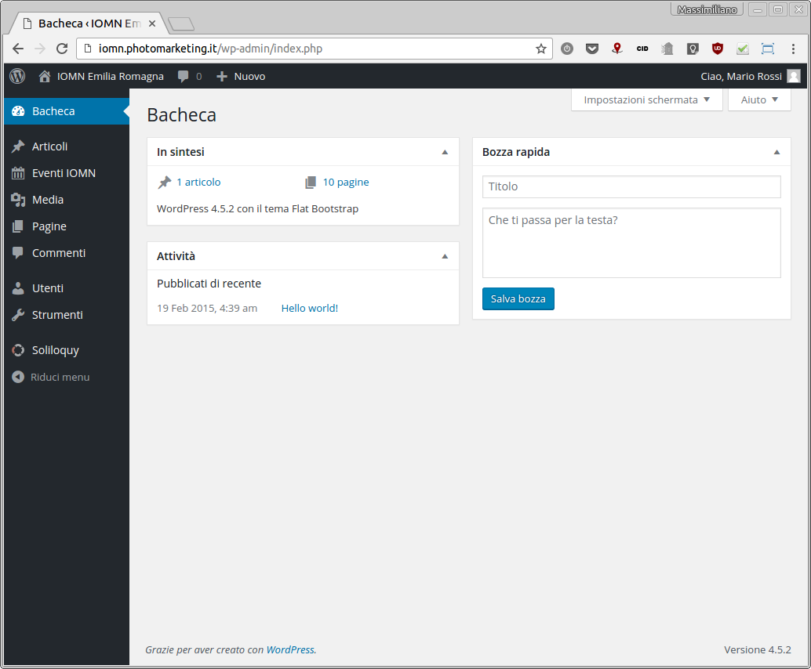
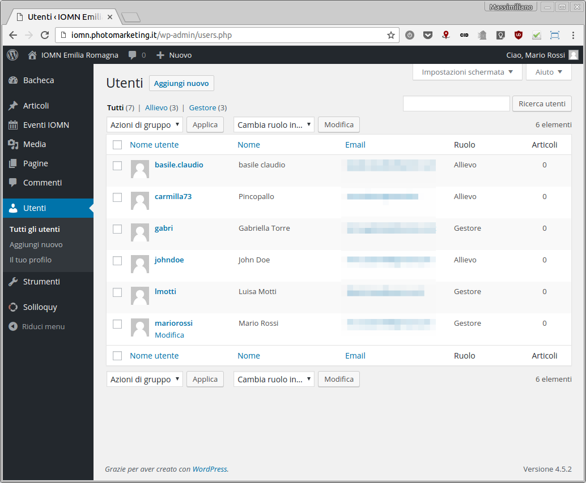
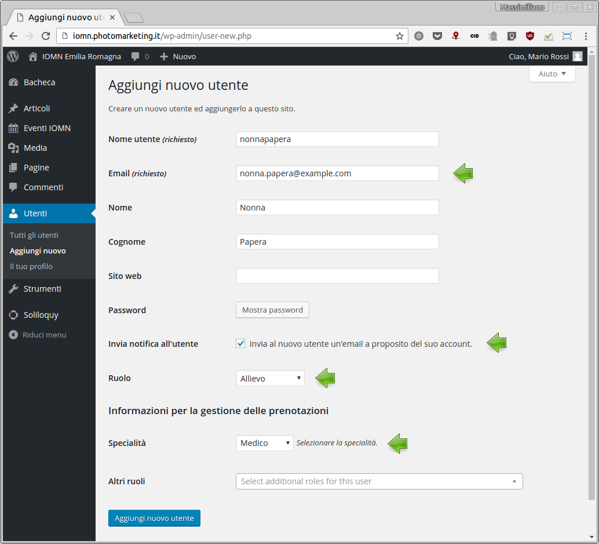
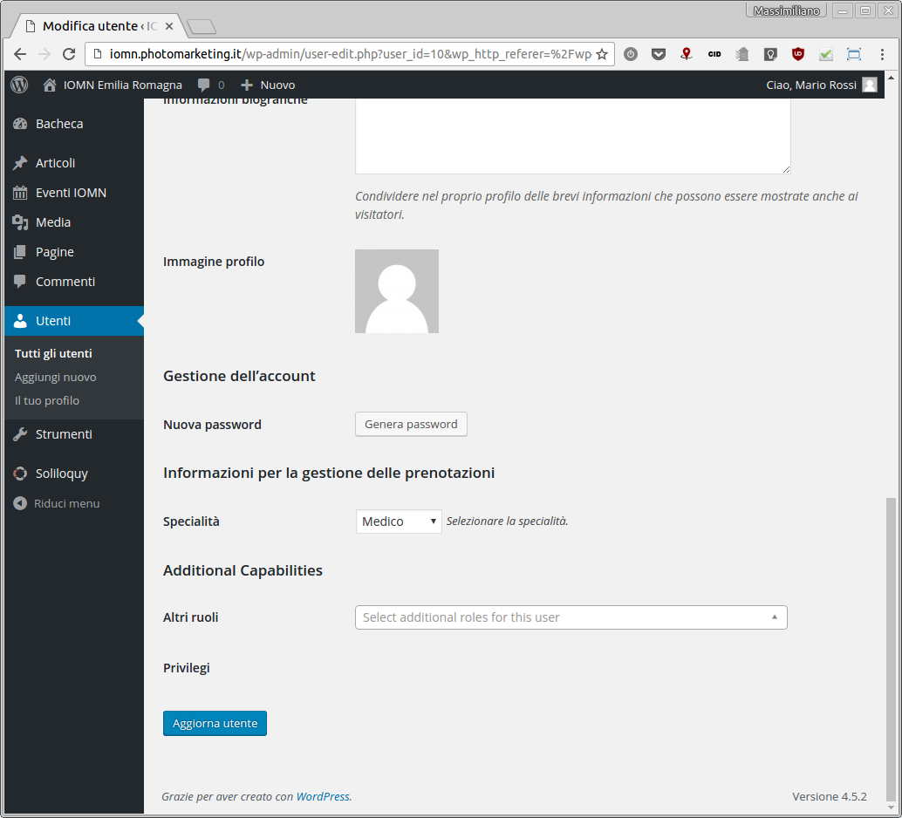
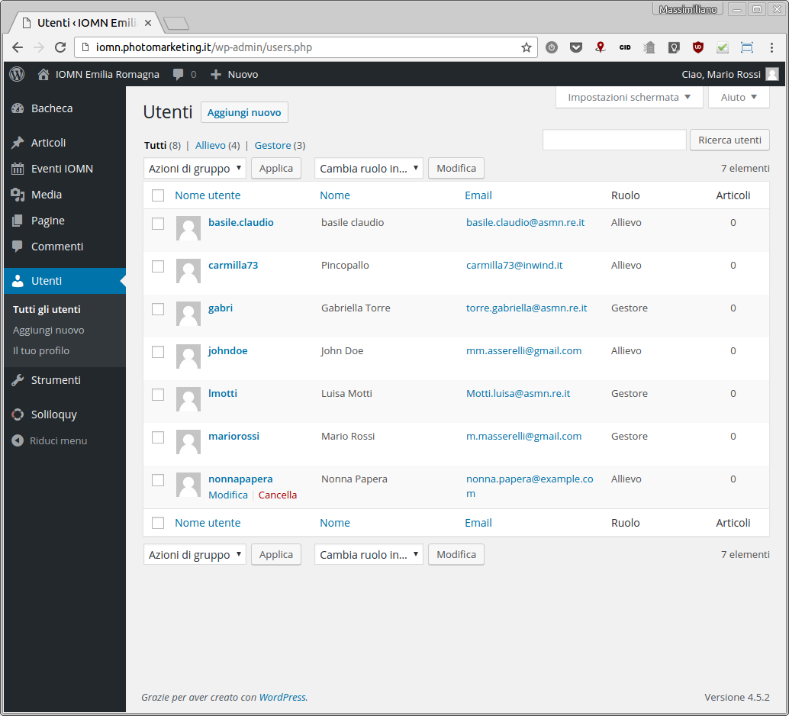
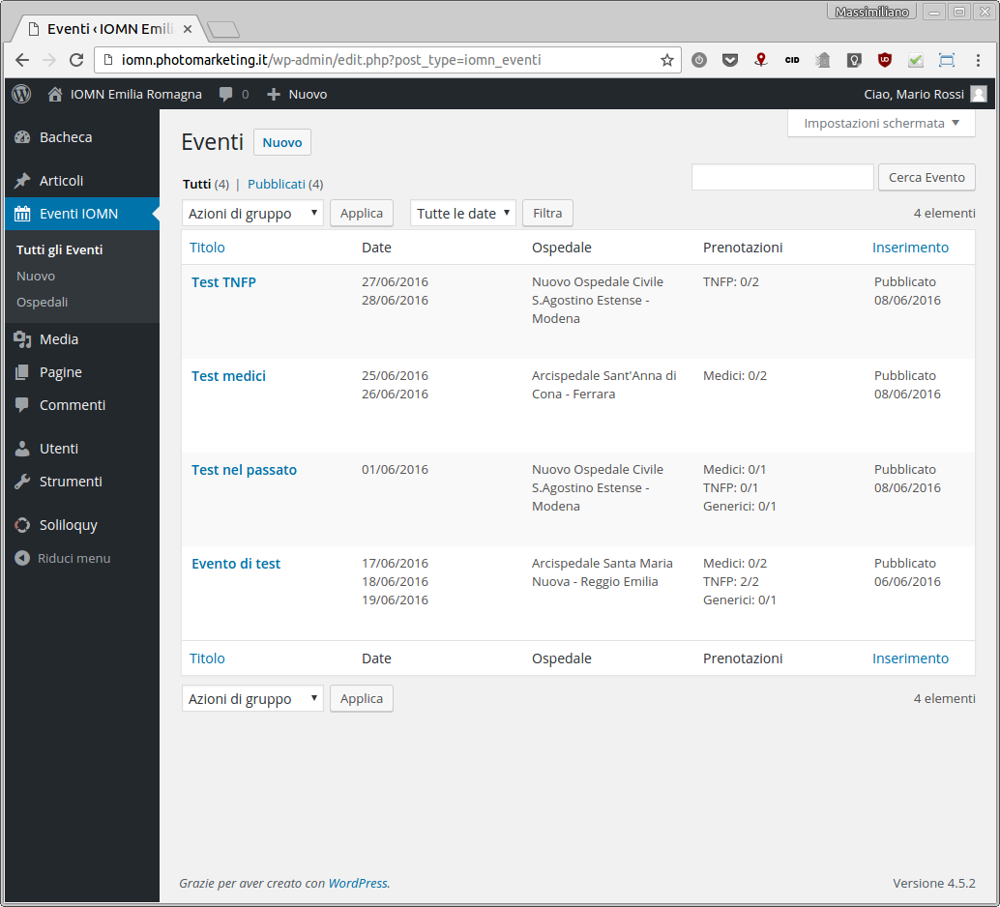
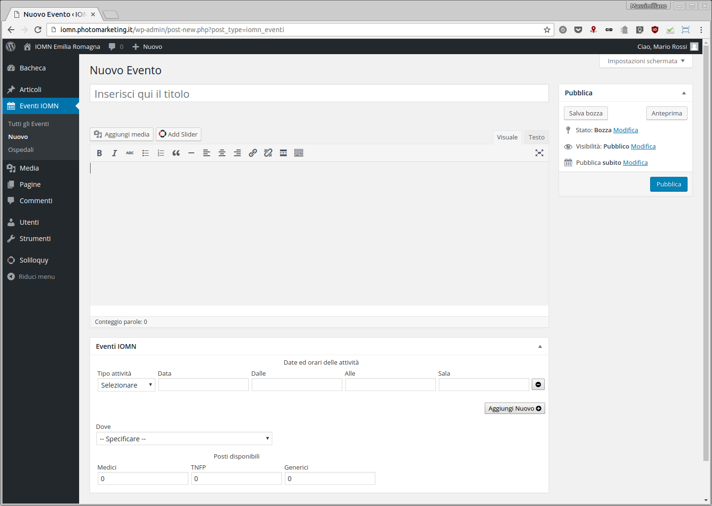
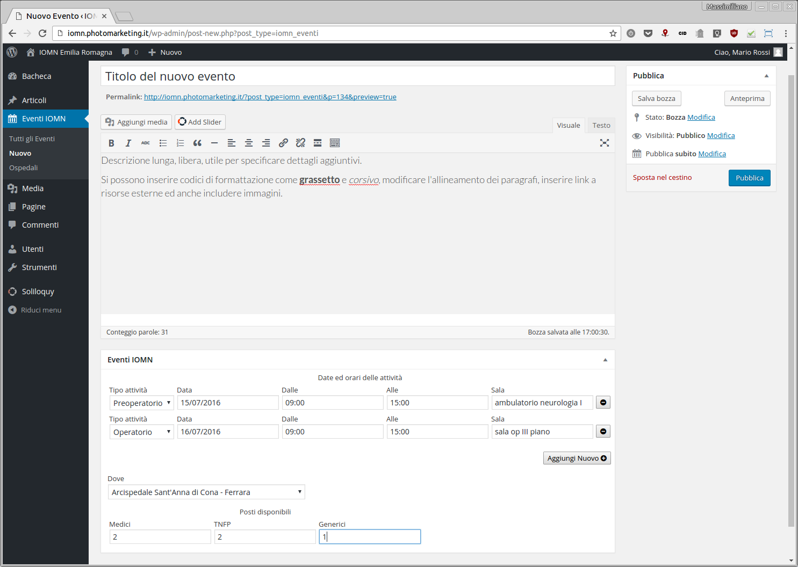

Sezione amministrativa
======================

La console
----------

Una volta effettuato il login, dall'indirizzo http://iomn.photomarketing.it/wp-admin/ , si accede alla console di amministrazione del sito.

L'aspetto della console è personalizzabile, quindi le immagini sono solamente indicative, ma le funzionalità abilitate sono le stesse per tutti i gestori. L'accesso alla console per l'inserimento e la gestione di eventi ed utenti è possibile solamente agli utenti che hanno un privilegio pari a "Gestore" o "Amministratore". L'utente utilizzato in questo esempio ha privilegi di "Gestore", così da non complicare inutilmente le schermate presentate con tutte le opzioni a disposizione dell'amministratore del sito (possibilità di modificare la grafica, installare o rimuovere funzionalità, ecc...).

La barra nera che appare in alto resterà sempre visibile, fintanto che non si esegue il logout, anche navigando sulle pagine "pubbliche", quelle dedicate alla consultazione e prenotazione degli eventi. Per visualizzarle, fare click in alto a sinistra sulla voce "IOMN Emilia Romagna". Avvicinando il cursore alla scritta, senza selezionarla, apparirà la voce "Visualizza sito", che funziona allo stesso modo.

Quando ci si trova sulle pagine pubbliche, selezionando la voce "IOMN Emilia Romagna" si verrà ricondotti alla bacheca di amministrazione. In questo caso, avvicinando il cursore alla scritta apparirà la voce "Bacheca".

Gestione utenti
---------------

La creazione di nuovi utenti per gli allievi, la modifica dei loro dati e la loro cancellazione al termine del percorso formativo sono a carico dei gestori del sito ("la Segreteria").

Facendo click nella barra di sinistra sulla voce "Utenti" si aprirà un sotto-menu con le opzioni disponibili ed apparirà la lista degli utenti presenti sul sito. Qualora il loro numero sia elevato, verrà presentata soltanto una lista parziale, consultabile per pagine.

Le operazioni possibili sono diverse, così come le strade possibili per la loro esecuzione ed in linea di massima dovrebbero essere facilmente comprensibili seguendo le istruzioni a schermo. Di seguito ci concentreremo sulle operazioni essenziali per la manutenzione ordinaria.

### Creazione nuovo utente

Facendo click a sinistra nella barra sulla voce "Aggiungi nuovo" oppure sul'omonimo bottone in alto sopra la lista utenti si raggiunge la pagina di creazione di un nuovo utente.

I campi richiesti, qui compilati a titolo esemplificativo, non dovrebbero richiedere una spiegazione particolare. Nell'immagine, i parametri cui prestare particolare attenzione sono evidenziati da una grossa freccia verde.

Il "Nome utente" è un nome di fantasia che può essere utilizzato per accedere al sito in alternativa all'indirizzo email. Non ha alcun tipo di limitazione circa il formato utilizzabile se non che non può contenere spaazi, tuttavia si suggerisce di utilizzare una parola composta dal nome e cognome del nuovo utente, in minuscolo, senza spazi.

L'indirizzo "Email" sarà utilizzato per inviare al nuovo utente le comunicazioni dal sito, per permettergli di impostare una password di accesso ed eventualmente per permettergli di recuperare la password qualora l'avesse dimenticata. È dunque **vitale** che sia inserito correttamente.

La spunta sulla casella "Invia notifica all'utente" farà in modo che all'atto dell'inserimento del nuovo utente venga inviata una mail all'indirizzo specificato con le istruzioni per l'attivazione della password. Qualora non venisse spuntata dovrà essere cura di chi esegue l'inserimento comunicare al nuovo utente la password da utilizzare (visualizzabile col bottone "Mostra password").

Il "Ruolo" indica i privilegi di accesso che saranno assegnati al nuovo utente. Per gli allievi il ruolo dovrà essere "Allievo", mentre per gli organizzatori della scuola dovrà essere "Gestore".

La "Specialità" indica invece il tipo di percorso formativo. Si può scegliere tra "Medico", "TNFP" e "Specificare" (ovvero nessuna scelta). Questa informazione è importante perché viene utilizzata per mostrare la disponibilità dei posti prenotabili per ciascun evento, dunque è bene che sia inserita con attenzione. Nel caso in cui non venga effettuata una scelta, non sarà possibile prenotare attività riservate a medici o tecnici TNFP.

Una volta compilate tutte le informazioni, fare click sul pulsante "Aggiungi nuovo utente" per completare l'inserimento. Si verrà portati sulla lista utente, dove sarà presente anche il nominativo appena inserito.

### Modifica utente

Qualora si presentasse la necessità di modificare i dati relativi ad un utente, ad esempio per modificare il suo indirizzo di posta elettronica, la sua specialità o altro, è possibile cliccare sul suo "Nome utente" nella lista. Si aprirà una pagina molto simile a quella utilizzata per l'inserimento, per la quale valgono le medesime considerazioni.

Una volta terminate le modifiche necessarie, scorrere fino in fondo alla pagina e fare clic sul pulsante "Aggiorna utente".

**ATTENZIONE**: qualora venga impostata la password di accesso in questo modo, facendo click sul bottone "Genera password", essa **non** sarà comunicata automaticamente all'utente, che andrà pertanto informato direttamente.

### Cancellazione utente

Per rimuovere un utente dalla lista degli autorizzati all'accesso, il procedimento più veloce consiste nell'avvicinare il cursore del mouse al nome da cancellare. Immediatamente appariranno altre voci selezionabili tra cui, in rosso, "Cancella".

Facendo clic sulla scritta "Cancella" ci si troverà su una pagina di conferma, nella quale occorrerà fare click sul bottone "Conferma cancellazione". A questo punto l'utente non sarà più presente nella lista e tutte le sue prenotazioni saranno invalidate. Anche ricreandolo di nuovo con lo stesso nome utente e la stessa password non sarà possibile recuperarle.

Gestione prenotazioni
---------------------

Selezionando la voce "Eventi IOMN" nella colonna di sinistra si avrà accesso alla lista degli eventi in programma, oltre a scoprire un sotto-menu per la gestione delle attività.

Per ogni evento vengono visualizzate le date in cui sono programmate le attività didattiche, l'ospedale presso cui verrà svolta la formazione ed il numero di prenotazioni registrate fino all'istante in cui si è caricata la pagina, divise per specialità.

### Inserimento nuovo evento

Per aprire la pagina di inserimento di un nuovo evento selezionare la voce "Nuovo" nella barra di sinistra oppure il pulsante "Nuovo" sopra la lista degli eventi.

Compilare le informazioni relative all'attività inserendo il titolo che verrà mostrato nella visualizzazione del calendario, la descrizione estesa che sarà leggibile nella pagina con i dettagli, la data e l'ora di inizio e fine del primo appuntamento ed eventualmente la sala (sala operatoria, ambulatorio, ufficio, ecc...) in cui avverrà l'incontro.

Qualora l'evento di formazione sia organizzato su più giornate, dopo aver inserito i dettagli della prima fare click sul pulsante "Aggiungi nuovo". Apparirà una nuova riga, vuota, sotto la precendente, dove proseguire con l'inserimento delle informazioni. Al momento non è previsto un controllo sul numero di giornate che è possibile inserire, ma per questioni di leggibilità si raccomanda di non superare le tre righe.

Terminato l'inserimento delle date, specificare presso quale ospedale verrà svolta la formazione ed indicare la disponibilità di posti prenotabili per specialità. I posti indicati alla voce "Medici" saranno disponibili soltanto per gli utenti che avranno la voce "Specialità" del loro profilo impostata sul valore "Medico". Similmente, la voce "TNFP" indicherà i posti a disposizione per la relativa tipologia di utenti, mentre ai posti indicati come "Generici" potranno accedere entrambe le tipologie di allievi.

Terminata la compilazione, dopo aver verificato la correttezza dei dati, fare clic sul bottone "Pubblica" in alto a destra. Da quel momento, l'evento sarà consultabile da parte degli utenti del sito e verrà visualizzato tramite il calendario nella pagina principale.

Qualora si decidesse di abbandonare la compilazione, selezionare il collegamento "Sposta nel cestino". **ATTENZIONE**: la cancellazione è immediata e non viene chiesta conferma.

È anche possibile compilare solo parzialmente le informazioni e salvare l'evento come "Bozza", facendo click sul pulsante "Salva bozza". In questo caso l'evento sarà memorizzato e mostrato nella lista eventi nella console di amministrazione assieme a quelli pubblicati ma **non** sarà visualizzato nel calendario e non apparirà tra quelli consultabili dagli utenti del sito. In qualunque momento sarà possibile aprire nuovamente la pagina di modifica, dalla lista eventi, e pubblicare l'evento facendo click su "Pubblica".
