Accredito nuovo utente
======================

Dopo aver comunicato alla segreteria l'indirizzo email da utilizzare per le comunicazioni, verrà predisposto il codice utente da utilizzare per l'accesso al sito.

La prima operazione da compiere, una volta creato l'account, è la sua attivazione. A seguito della creazione del nuovo utente da parte della Segreteria, si riceverà nella propria casella una mail simile a quella riportata in figura.

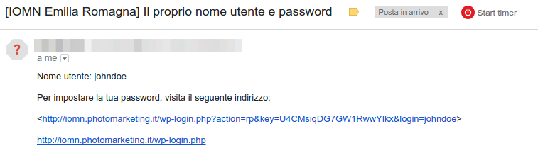

Sarà necessario seguire il primo collegamento proposto, quello con l'indirizzo più lungo e contenente la parola "key=" al suo interno. Eseguita questa operazione, ci si troverà di fronte ad una schermata dove sarà possibile impostare la propria password di accesso.

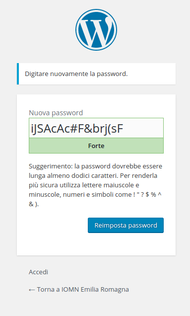

Si può decidere di accettare quella suggerita dal sistema, che viene presentata nella casella "Nuova password", oppure inserire al suo posto una di proprio gradimento. Il sistema fornisce una valutazione della robustezza della parola chiave, si raccomanda di sceglierne una abbastanza forte. Facendo clic sul pulsante "Reimposta password" si memorizza la parola chiave che andrà utilizzata per i prossimi accessi. Il sistema mostrerà una pagina di conferma ed invierà una mail all'indirizzo memorizzato con la comunicazione dell'avvenuta impostazione della password.

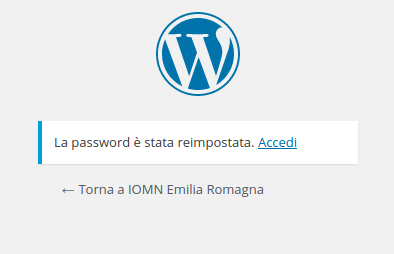

Facendo clic su "Accedi" si finirà nella console di amministrazione del proprio profilo.

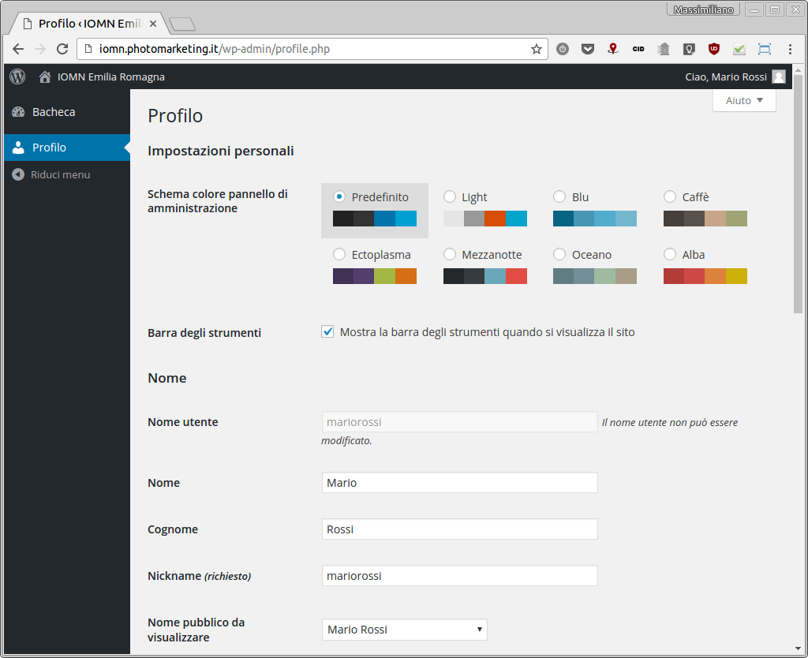

Da qui si può modificare lo schema colore della console amministrativa e si possono verificare i propri dati personali. Si prega di prestare la massima attenzione alle eventuali modifiche che si deciderà di apportare rispetto ai dati inseriti dalla Segreteria poiché questo potrebbe pregiudicare il corretto funzionamento delle procedure di visualizzazione e prenotazione delle attività formative. Facendo clic in alto a sinistra su "IOMN Emilia Romagna" si verrà condotti alla pagina principale del sito, con la visualizzazione del calendario.

Sezione utente
==============

Accesso senza credenziali
-------------------------

L'accesso al sito è riservato solamente agli amministratori ed agli studenti della scuola. Collegandosi all'indirizzo del sito senza aver prima fornito le credenziali, si viene accolti da una pagina simile a quella rappresentata in figura. È necessario a questo punto seguire il link "Eseguire l'accesso".

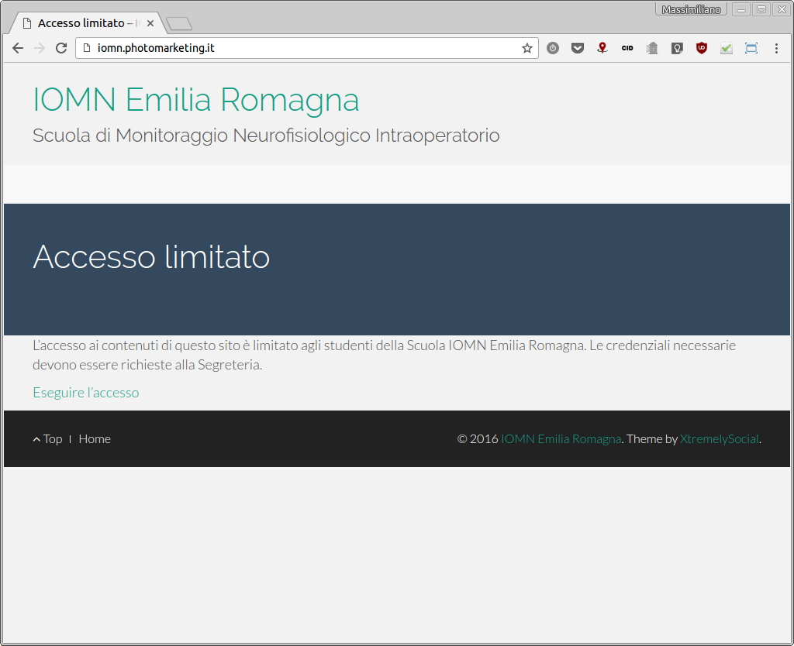

Inserimento credenziali
-----------------------

La schermata per l'inserimento dei propri dati è quella propria del sistema di pubblicazione che abbiamo utilizzato ed appare come nell'immagine seguente.

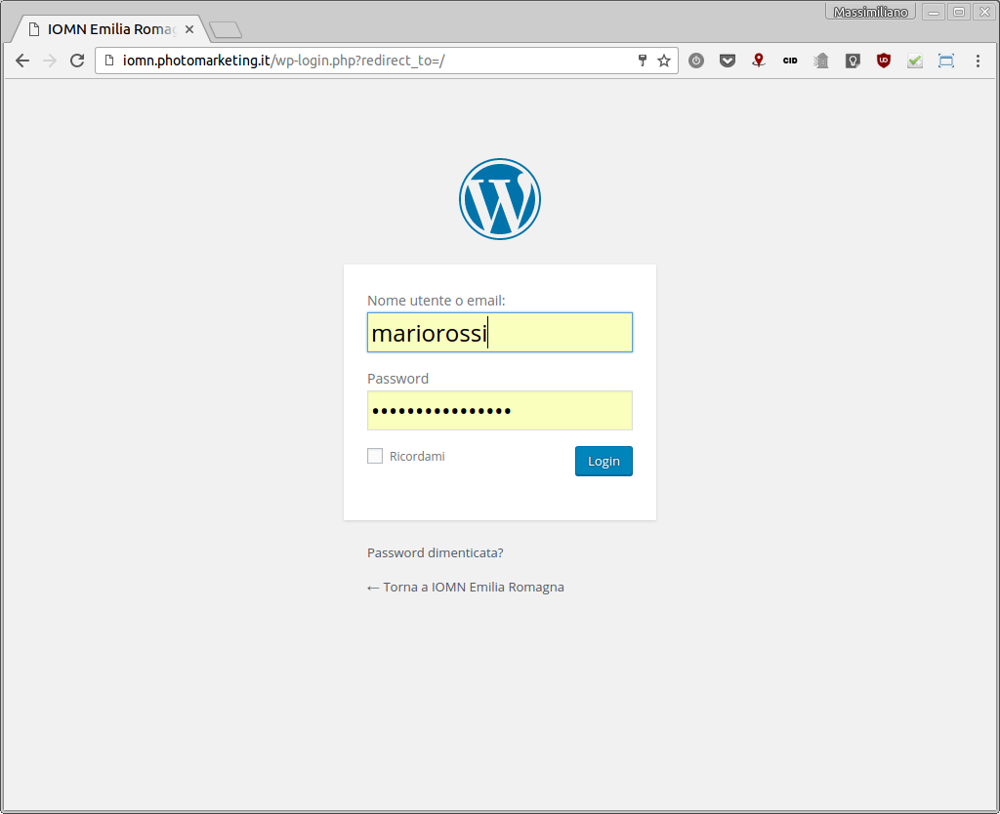

Il campo "Nome utente" va compilato con lo username ricevuto dalla segreteria oppure con l'indirizzo email che è stato comunicato in fase di raccolta dei dati. La password è quella che è stata decisa al momento del primo collegamento oppure quella che è stata modificata in seguito.

NB: è importante memorizzare la password in un luogo sicuro, in quanto nessuno è a conoscenza della stessa. Tuttavia è previsto un metodo per resettare le credenziali di accesso, utilizzando il proprio indirizzo email. Basterà fare clic sul link "Password dimenticata" e seguire le istruzioni proposte.

La casella spuntabile "Ricordami" serve per poter accedere al sito il più a lungo possibile senza la necessità di inserire nuovamente le credenziali, a patto di utilizzare sempre lo stesso navigatore (Chrome, Edge, Firefox, Internet Explorer, Safari, ecc…). Si raccomanda di utilizzare questa opzione con prudenza e soltanto su computer personali per evitare che altri possano accedere alle prenotazioni senza conoscere la password.

Pagina principale
-----------------

Una volta effettuato l'accesso, ci si troverà di fronte alla pagina principale del sistema di prenotazione, da cui sarà possibile consultare le sessioni didattiche in programma.

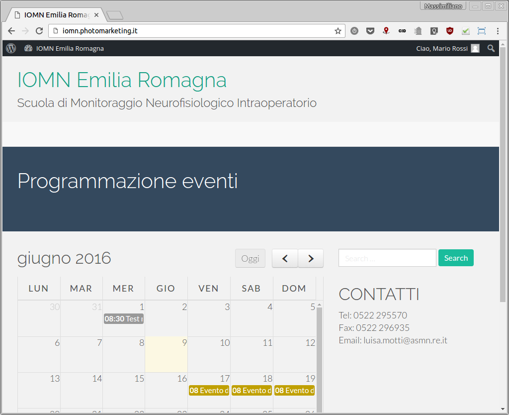

Oltre al calendario è possibile consultare velocemente le informazioni di contatto per la segreteria della Scuola e si può accedere alle altre funzionalità del sito tramite appositi link.

Il calendario
-------------

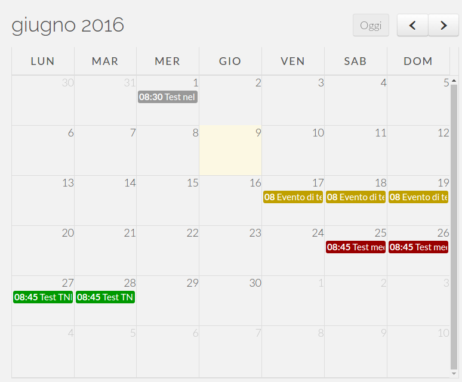 In questa immagine di esempio possiamo vedere lo specchietto del mese di giugno 2016, con alcuni eventi esemplificativi.

Il riquadro con sfondo giallo chiaro indica la data corrente. Le scritte con sfondo colorato nei rispettivi riquadri con indicato il giorno del mese descrivono invece gli eventi in programma, col titolo preceduto dall'orario di inizio.

I colori di sfondo si riferiscono alla disponibilità di prenotazione:* sfondo grigio: l'evento è in tutto o in parte nel passato, quindi non è più possibile interagire con la prenotazione* sfondo giallo: l'evento è già stato prenotato dall'utente collegato in questo momento* sfondo rosso: non ci sono più posti disponibili per l'evento in questione, relativamente alla specializzazione dell'utente (medico o TNFP)* sfondo verde: l'evento ha ancora posti disponibili per la prenotazione

Avvicinando il cursore del mouse ad una delle caselle dell'evento viene riportato il titolo per esteso.

Facendo click sul titolo dell'evento, si aprirà una finestra pop-up in alto nella pagina, con riportati maggiori dettagli circa l'attività.

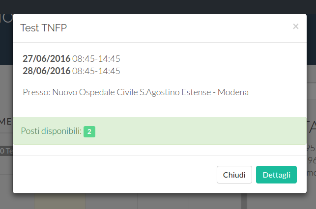

Come si vede, vengono riportate le date e gli orari delle diverse giornate che compongono l'attività formativa selezionata (indipendentemente da quale sia stato il giorno specifico su cui si è fatto click). Sono riportati anche i posti disponibili per la sessione o un messaggio che comunica l'impossibilità di prenotare (evento nel passato, posti esauriti o prenotazione già effettuata in precedenza).

Facendo click sul bottone "Dettagli" in basso a destra si accede alla pagina con la descrizione dettagliata dell'evento.

Dettagli evento
---------------

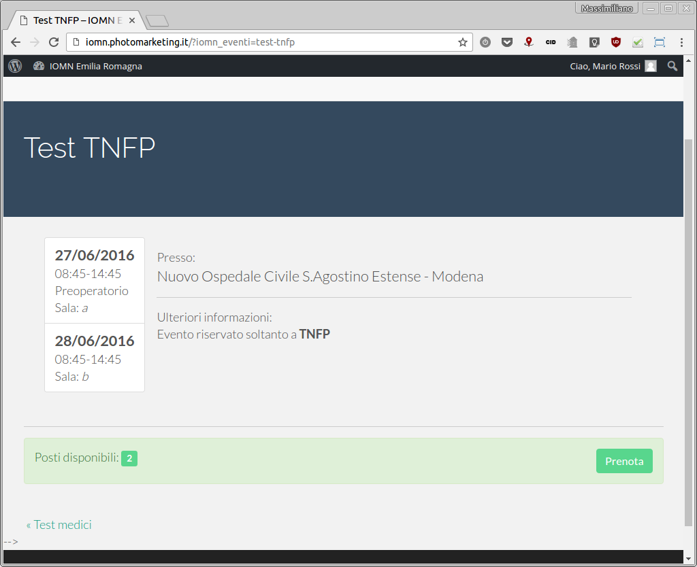

In questa pagina vengono riportati tutti i dettagli relativi all'evento selezionato.

In alto, su sfondo scuro, il titolo dell'attività di formazione: in genere una descrizione del tipo di operazione che si andrà ad eseguire.

Sulla sinistra, su sfondo bianco, sono riportate le date e gli orari delle sessioni formative, con indicazioni del tipo di attività (es. pre-operatorio od operatorio) ed eventualmente la sala in cui verrà tenuta la formazione.

Sulla destra viene invece indicato l'ospedale presso cui verrà effettuata l'operazione. Subito sotto eventuali note aggiuntive relative all'attività di formazione (ad esempio può essere descritto l'iter che si seguirà prima e dopo l'operazione, il metodo di discussione dei risultati, ecc...).

In fondo, in questo caso su sfondo verde, un'indicazione dei posti disponibili ed il bottone per eseguire la prenotazione.

Ancora più in basso, un collegamento all'evento precedente, di cui viene riportato il titolo. Nell'immagine qui sopra non è presente, ma ovviamente sulla destra, quando appropriato, verrà riportato il titolo dell'evento successivo in programma.

Facendo click sul bottone "Prenota" si aprirà una finestra pop-up tramite la quale confermare la propria intenzione di partecipare.

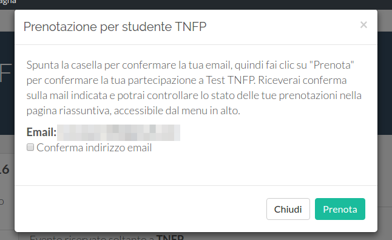

Nella richiesta di conferma viene presentato un riassunto dei dati necessari e viene mostrato l'indirizzo email collegato all'account, al quale verrà inviata una mail di conferma. È importante verificare sempre l'esattezza di questo dato, perché questo indirizzo verrà usato per le eventuali comunicazioni relative alla formazione (cambio di data, cancellazione dell'evento, ecc...).

Spuntando la casella "Conferma indirizzo email" e facendo click sul bottone "Prenota" si conferma la propria partecipazione all'evento. Un messaggio di conferma dovrebbe apparire entro breve tempo nella propria casella di posta elettronica, con un riassunto dei dettagli dell'evento. Qualora questo messaggio non dovesse apparire, controllare che non sia finito per errore nella cartella "Spam". In caso contrario contattare la Segreteria per comunicare il mancato funzionamento della procedura.

Disdetta della prenotazione
---------------------------

Nel malaugurato caso in cui sia necessario disdire la propria presenza per uno degli eventi prenotati in precedenza, occorre selezionarlo dal calendario e portarsi sulla pagina di dettaglio. Qui, nella riga colorata in basso, si troverà il pulsante "Disdici", cliccando il quale si aprirà una finestra di conferma. 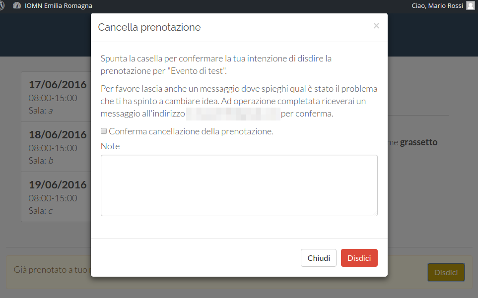 Nella finestra è necessario spuntare la casella di conferma ed inserire una nota relativa alla motivazione che ha portato alla disdetta. Facendo click su "Disdici", verrà inviato un messaggio di conferma all'indirizzo email indicato ed il posto prenotato tornerà nuovamente nella disponibilità degli altri partecipanti.
